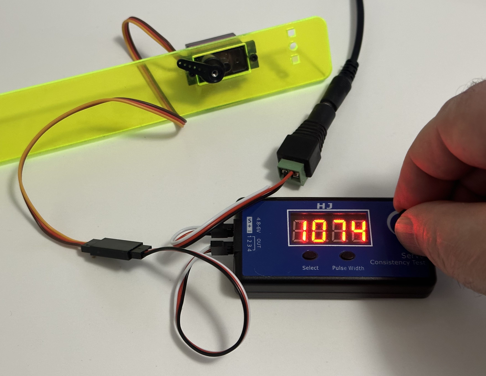
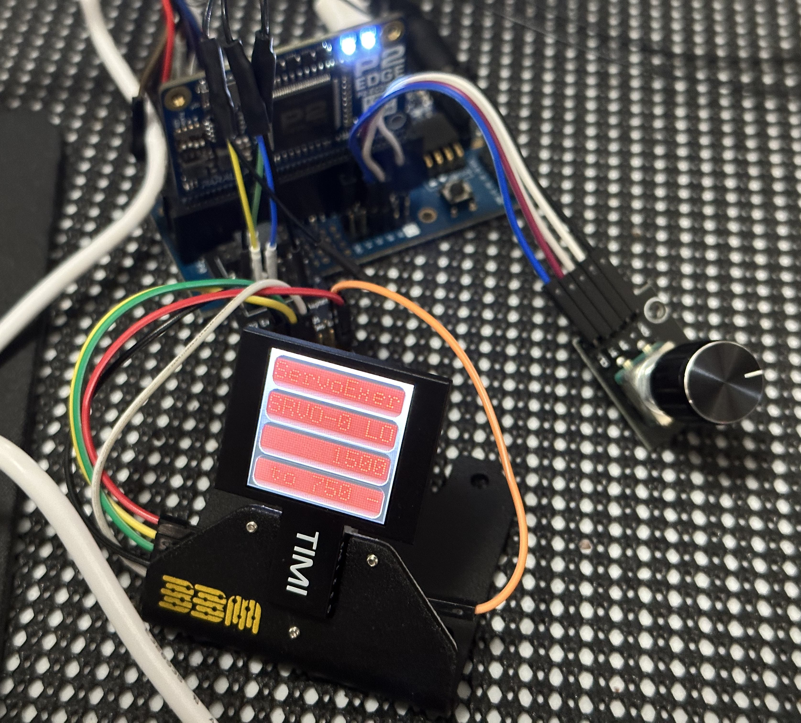
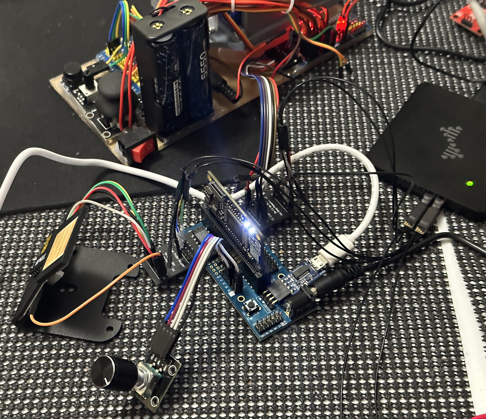
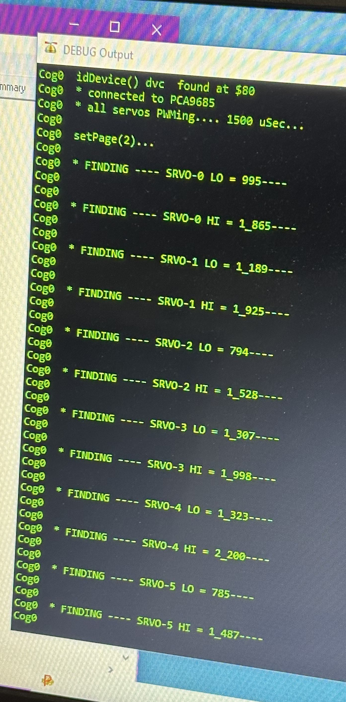

# P2 Multi-servo Exerciser
Exercise/Characterize multiple servos connected via PCA9685 PWM controller

![Project Maintenance][maintenance-shield]

[![License][license-shield]](LICENSE)

## Table of Contents

On this Page:

- [Features](#features)
- Pictures of this project in use
- [How to contribute](#how-to-contribute)

Additional pages:

- [The rotary Encoder object](./RotaryEnc.md) - Reusable object for reading rotary encoder with push button
- [The TIMI Interface object](./TIMI.md) - Reusable object for driving all of the TIMI Displays
- [The TIMI-130 Datasheet](./Docs/TIMI-130_Datasheet_REV1.0.pdf) 

## Exerciser with OLED display and Rotary Encoder for control

Most of us playing with servos in our projects have a single servo tester:

  

But when we are using a 16-channel PWM controller driving our servos we can either unplug each servo to test it or we can do something like this project! 

I grabbed a TIMI-130 serial attached OLED display and a rotary encoder with pushbutton feature as be my interface and I used code I already had for the PCA9685 controller.  

I then wrote a driver for the encoder which provided distance and velocity for the turning part a single, double-click for the push button part. [See RotaryEncoder page](./RotaryEnc.md)

Then I created a single TIMI interface object by porting the python TIMI library. Now I can drive the display. [See TIMI Displays page](./TIMI.md)

In the end my cobbled together tester looks like this:

  

And this is the tester connected to the back of the 6-servo hardware I'm characterizing:

  

Lastly, this is the output from the tester:

  

### Features

To use this exercisor simply connect to the PCA9685 i2c bus and run the project.

- Steps through each of the servos from 0-15
- Cycles LO and HI for each servo
- Reminds which end of the range is currently being tested
- Emits (via debug_ the final LO, HI values for each servo tested.

Enjoy!

## How to Contribute

This is a project supporting our P2 Development Community. Please feel free to contribute to this project. You can contribute in the following ways:

- File **Feature Requests** or **Issues** (describing things you are seeing while using our code) at the [Project Issue Tracking Page](https://github.com/ironsheep/P2-Click-UWB/issues)
- Fork this repo and then add your code to it. Finally, create a Pull Request to contribute your code back to this repository for inclusion with the projects code. See [CONTRIBUTING](CONTRIBUTING.md)

---

> If you like my work and/or this has helped you in some way then feel free to help me out for a couple of :coffee:'s or :pizza: slices!
>
>  &nbsp;&nbsp; -OR- &nbsp;&nbsp; [Patreon.com/IronSheep](https://www.patreon.com/IronSheep?fan_landing=true)

---

## Disclaimer and Legal

> *Parallax, Propeller Spin, and the Parallax and Propeller Hat logos* are trademarks of Parallax Inc., dba Parallax Semiconductor
>
> This project is a community project not for commercial use.
>
> This project is in no way affiliated with, authorized, maintained, sponsored or endorsed by *Parallax Inc., dba Parallax Semiconductor* or any of its affiliates or subsidiaries.

---

## License

Copyright © 2022 Iron Sheep Productions, LLC. All rights reserved.

Licensed under the MIT License.

Follow these links for more information:

### [Copyright](copyright) | [License](LICENSE)

[maintenance-shield]: https://img.shields.io/badge/maintainer-stephen%40ironsheep%2ebiz-blue.svg?style=for-the-badge

[license-shield]: https://camo.githubusercontent.com/bc04f96d911ea5f6e3b00e44fc0731ea74c8e1e9/68747470733a2f2f696d672e736869656c64732e696f2f6769746875622f6c6963656e73652f69616e74726963682f746578742d646976696465722d726f772e7376673f7374796c653d666f722d7468652d6261646765
