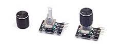

# P2 Rotary Encoder Spin2 Object
A reusable object written in spin2 for reading the rotary encoder with the push button feature. This object features reading of rotation distance and velocity while the button press logic detects single and double-clicks.

![Project Maintenance][maintenance-shield]

[![License][license-shield]](LICENSE)

## Table of Contents

On this Page:

- [The Hardware](#the-hardware)
- [The Public Interface](#the-rotary-encoder-object-public-interface)
- [The Source Code](#the-object-source-code)

Additional pages:

- [Enclosing Project README](./README.md) - The top level documentation for the overall project
- [The TIMI Interface object](./TIMI.md) - Reusable object for driving all of the TIMI Displays
- [The TIMI-130 Datasheet](./Docs/TIMI-130_Datasheet_REV1.0.pdf) 

## The Hardware

This object support the standard Parallax Rotary Encoder.

  

This device is connected by 3 signal wires, Vcc and ground.

The driver runs a task in a single Cog which continuously monitors the rotation and button presses.  The driver provides the following readings from the attached hardware:

- Rotational distance
- Rotational Scaled distance (*distance x velocity x scale value*)
- Rotational velocity
- Button presses
- For each button press, if it is a single our double-press

## The Rotary Encoder object PUBLIC Interface

The object **isp\_quadEncWBtn_sp.spin2** when first started fires a separate monitoring task in a Spin Cog. When you read the values you are reading the latest stored values written by the monitoring task. 
The object provides the following methods for starting up, tearing down and accessing the values read from the device:

| OBJECT Interface | Description |
| --- | --- |
|  **>--- CONTROL**
| <PRE>PUB start(pnEnc0, pnEnc1, pnBtn)</PRE> | Start the sensing Cog using the given pins 
| <PRE>PUB stop()</PRE> | Stop the sensing Cog, clear and float the pins used.
| <PRE>PUB setScale(scaleValue)</PRE> | Set encoder distance scaling to {scaleValue}  [Default: 4]
| <PRE>PUB getScale() : scaleValue</PRE> | Return encoder distance {scaleValue}
|  **>--- SENSING**
| <PRE>PUB isButtonPressed() : bIsPressed, bIsDouble</PRE> | Return {bIsPressed} - T/F where T means button was pressed   and {bIsDouble} - T/F where T means the press was a double press |
| <PRE>PUB position() : currPosn</PRE> | Return {currRate} the current quadEncoder steps since last rotation N where N=[0-n] |
| <PRE>PUB positionScaled() : currScaledPosn</PRE> | Return scaled value for current quadEncoder position N where N=[-n < 0 < n] AFFECTED BY: setScale(scaleValue)|
| <PRE>PUB rate() : currRate</PRE> | Return {currPosn} the current quadEncoder position N where N=[-n < 0 < n] |
| <PRE>PUB positionRate() : currPosn, currRate</PRE> | Return {currPosn} the current quadEncoder position N where N=[-n < 0 < n]   and {currRate} the current quadEncoder steps since last rotation N where N=[0-n] |

**NOTE:** this object uses 4 smart pins for the quad position decoding.  Two connected to the rotary encoder which track current position, while two additional pins (at lower pin number -1 -and -2, are connected to the same two inputs) which track the velocity of the rotation. The 5th pin then senses the button press events.

## The Object Source Code

The following files comprise our driver source code:

| Filename | Purpose | Description |
| --- | --- | --- |
| **Driver FILEs**
| [isp\_quadEncWBtn_sp.spin2](isp_quadEncWBtn_sp.spin2) | DRIVER | the Rotary Encoder Driver object using smartpins

---

> If you like my work and/or this has helped you in some way then feel free to help me out for a couple of :coffee:'s or :pizza: slices!
>
>  &nbsp;&nbsp; -OR- &nbsp;&nbsp; [Patreon.com/IronSheep](https://www.patreon.com/IronSheep?fan_landing=true)

---

## Disclaimer and Legal

> *Parallax, Propeller Spin, and the Parallax and Propeller Hat logos* are trademarks of Parallax Inc., dba Parallax Semiconductor
>
> This project is a community project not for commercial use.
>
> This project is in no way affiliated with, authorized, maintained, sponsored or endorsed by *Parallax Inc., dba Parallax Semiconductor* or any of its affiliates or subsidiaries.

---

## License

Copyright © 2023 Iron Sheep Productions, LLC. All rights reserved.

Licensed under the MIT License.

Follow these links for more information:

### [Copyright](copyright) | [License](LICENSE)

[maintenance-shield]: https://img.shields.io/badge/maintainer-stephen%40ironsheep%2ebiz-blue.svg?style=for-the-badge

[license-shield]: https://camo.githubusercontent.com/bc04f96d911ea5f6e3b00e44fc0731ea74c8e1e9/68747470733a2f2f696d672e736869656c64732e696f2f6769746875622f6c6963656e73652f69616e74726963682f746578742d646976696465722d726f772e7376673f7374796c653d666f722d7468652d6261646765
