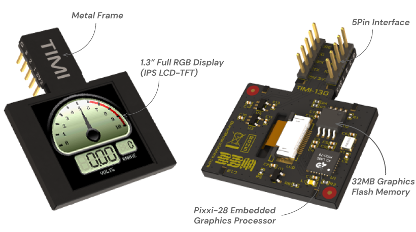

# P2 TIMI Spin2 Object
A reusable object written in spin2 for driving the TIMI serial IPS LCD-TFT displays.

![Project Maintenance][maintenance-shield]

[![License][license-shield]](LICENSE)

[Breadboard Mates (BBM)](https://breadboardmates.com/) produces the TIMI line of displays. These are similar to teh Nextion devices we've seen in that we select the screens to be displayed and upload them to the device (essentially flashing the device.) Then we connect the device containing the screens to our project via serial and simply send values to the screen fields or labels. 

## Table of Contents

On this Page:

- [Features](#features)
- Pictures of this project in use
- [How to contribute](#how-to-contribute)

Additional pages:

- [Enclosing Project README](./README.md) - The top level documentation for the overall project
- [The rotary Encoder object](./RotaryEnc.md) - Reusable object for reading rotary encoder with push button
- [The TIMI-130 Datasheet](./Docs/TIMI-130_Datasheet_REV1.0.pdf) 
- [Breadboard Mates Products](https://breadboardmates.com/products/) - shop the full line of products
- [Mates Studio](https://breadboardmates.com/products/mates-studio/) - The windows software for programming the TIMI devices

## The Hardware

Here is the [TIMI-130](https://breadboardmates.com/products/timi-130/) I'm using for this project:

## The TIMI Spin2 Object

The Object is contained in one file `isp_timi_mates.spin2`. 

## The Source Code

The following files comprise our demo and driver source code:

| Filename | Purpose | Description |
| --- | --- | --- |
| **Driver FILEs**
| [isp\_timi_mates.spin2](isp_timi_mates.spin2) | DRIVER | the TIMI Driver object
| [isp\_serial.spin2](isp_serial.spin2) | DRIVER | underlying serial HW interface
| [jm\_nstring.spin2](jm_ez_spi.spin2) | DRIVER | string formatting routines (fm JonnyMac)

---

> If you like my work and/or this has helped you in some way then feel free to help me out for a couple of :coffee:'s or :pizza: slices!
>
>  &nbsp;&nbsp; -OR- &nbsp;&nbsp; [Patreon.com/IronSheep](https://www.patreon.com/IronSheep?fan_landing=true)

---

## Disclaimer and Legal

> *Parallax, Propeller Spin, and the Parallax and Propeller Hat logos* are trademarks of Parallax Inc., dba Parallax Semiconductor
>
> This project is a community project not for commercial use.
>
> This project is in no way affiliated with, authorized, maintained, sponsored or endorsed by *Parallax Inc., dba Parallax Semiconductor* or any of its affiliates or subsidiaries.

---

## License

Copyright © 2023 Iron Sheep Productions, LLC. All rights reserved.

Licensed under the MIT License.

Follow these links for more information:

### [Copyright](copyright) | [License](LICENSE)

[maintenance-shield]: https://img.shields.io/badge/maintainer-stephen%40ironsheep%2ebiz-blue.svg?style=for-the-badge

[license-shield]: https://camo.githubusercontent.com/bc04f96d911ea5f6e3b00e44fc0731ea74c8e1e9/68747470733a2f2f696d672e736869656c64732e696f2f6769746875622f6c6963656e73652f69616e74726963682f746578742d646976696465722d726f772e7376673f7374796c653d666f722d7468652d6261646765
