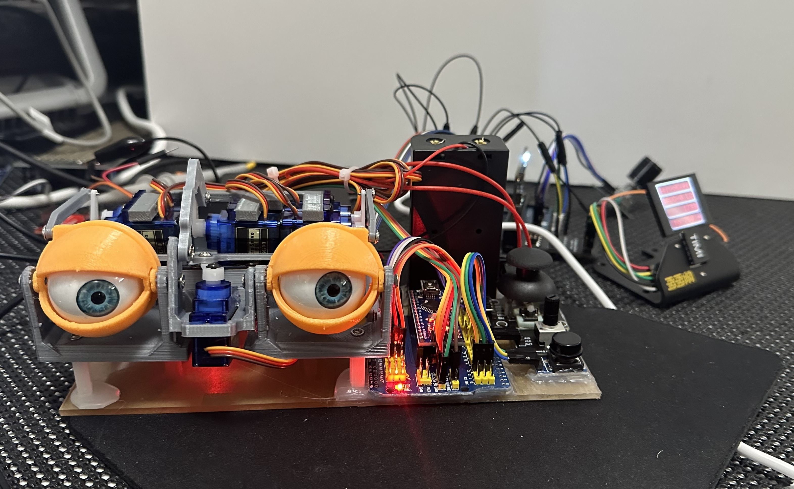

# P2 Multi-servo Exerciser - another Unit under Test
Exercise/Characterize multiple servos connected via PCA9685 PWM controller

![Project Maintenance][maintenance-shield]

[![License][license-shield]](LICENSE)

## Table of Contents

On this Page:

- Eyes as a test bed

Additional pages:

- [The rotary Encoder object](./RotaryEnc.md) - Reusable object for reading rotary encoder with push button
- [The TIMI Interface object](./TIMI.md) - Reusable object for driving all of the TIMI Displays
- [The TIMI-130 Datasheet](./Docs/TIMI-130_Datasheet_REV1.0.pdf) 

## Another Mechanism under servo testing

Hmmm, maybe we need to integrate this with a TOF flight controller and have the eyes follow who ever is walking by?! ;-)

  

  

  

  

And this is what it looks like after we range test the servos.

---

> If you like my work and/or this has helped you in some way then feel free to help me out for a couple of :coffee:'s or :pizza: slices!
>
>  &nbsp;&nbsp; -OR- &nbsp;&nbsp; [Patreon.com/IronSheep](https://www.patreon.com/IronSheep?fan_landing=true)

---

## Disclaimer and Legal

> *Parallax, Propeller Spin, and the Parallax and Propeller Hat logos* are trademarks of Parallax Inc., dba Parallax Semiconductor
>
> This project is a community project not for commercial use.
>
> This project is in no way affiliated with, authorized, maintained, sponsored or endorsed by *Parallax Inc., dba Parallax Semiconductor* or any of its affiliates or subsidiaries.

---

## License

Licensed under the MIT License.

Follow these links for more information:

### [Copyright](copyright) | [License](LICENSE)

[maintenance-shield]: https://img.shields.io/badge/maintainer-stephen%40ironsheep%2ebiz-blue.svg?style=for-the-badge

[license-shield]: https://img.shields.io/badge/License-MIT-yellow.svg
